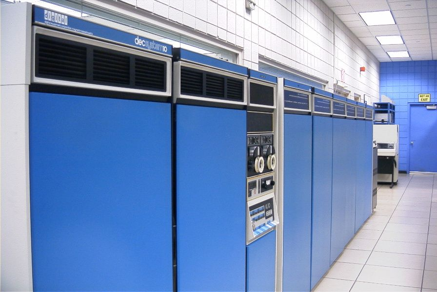

# Las aventuras conversacionales

## Definición

- La aventura conversacional es un género de videojuegos en el que la
  descripción de la situación en la que se encuentra el jugador proviene
  principalmente de un texto.

- A su vez, el jugador debe teclear la acción a realizar.

- El juego interpreta la entrada (normalmente) en lenguaje natural, lo cual
  provoca una nueva situación y así sucesivamente.

- A veces existen gráficos en estos juegos, que sin embargo son tan solo
  situacionales o que ofrecen ayuda complementaria en algunos casos, al estilo
  de las ilustraciones de un libro.

---

- Otros nombres:

  - Aventuras de texto.

  - Aventuras gráfico-conversacionales.

  - Ficción interactiva.

- No confundir con aventuras gráficas.

## La aventura original

## La aventura original

- ADVENT

- Adventure

- Colossal Cave

- Colossal Cave Adventure

---

- Creada por Will Crowther (1975-77).

- Ampliada luego por Don Woods (1977).

- Desarrollada en Fortran 4 para el DEC PDP-10.

:::: columns

::: column

:::

::: column

:::

::::

---

{width=70%}

# Por países

## EE. UU.

### Infocom

---

{width=50%}

- Fundada en 1979 por personal del MIT y estudiantes.

- Equipo directivo formado por Dave Lebling, Marc Blank, Albert Vezza y Joel
  Berez.

- Desarrollaron una treintena de títulos.

- Su obra más destacada: la serie _Zork_.

- Facturación de millones de euros anuales.

- Plantilla de más cien personas.

---

- El desarrollo de Cornerstone lastró la compañía.

- Vendida a Activision en 1986.

- Activision cerró Infocom en 1989.

---

- La serie _Zork_:
  - La trilogía _Zork_ original (Marc Blank y Dave Lebling):
    - _Zork I: The Great Underground Empire_ (1980)
    - _Zork II: The Wizard of Frobozz_ (1981)
    - _Zork III: The Dungeon Master_ (1982)
  - La trilogía Enchanter:
    - _Enchanter_ (1983, Marc Blank)
    - _Sorcerer_ (1984, Steve Meretzky)
    - _Spellbreaker_ (1985, Dave Lebling)
  - _Beyond Zork: The Coconut of Quendor_ (1987, Brian Moriarty)
  - _Zork Zero: The Revenge of Megaboz_ (1988, Steve Meretzky)
  - _Zork: The Undiscovered Underground_ (1997, Michael Berlyn y Marc Blank)

---

- La serie Planetfall:
  - Planetfall (1983, Steve Meretzky)
  - Stationfall (1987, Steve Meretzky)
- Deadline (1982, Marc Blank)
- Starcross (1982, Dave Lebling)
- Suspended: A Cryogenic Nightmare (1983, Michael Berlyn)
- Infidel (1983, Michael Berlyn)
- The Witness (1983, Stu Galley)
- Cutthroats (1984, Michael Berlyn & Jerry Wolper)
- The Hitchhiker's Guide to the Galaxy (1984, Steve Meretzky y Douglas Adams)
- Seastalker (1984, Stu Galley & Jim Lawrence)
- Suspect (1984, Dave Lebling)
- A Mind Forever Voyaging (1985, Steve Meretzky)
- Wishbringer: The Magick Stone of Dreams (1985, Brian Moriarty)
- Ballyhoo (1986, Jeff O'Neill)
- Hollywood Hijinx (1986, "Hollywood" Dave Anderson)
- Leather Goddesses of Phobos (1986, Steve Meretzky)
- Moonmist (1986, Stu Galley)
- Trinity (1986, Brian Moriarty)
- Border Zone (1987, Marc Blank)
- Bureaucracy (1987, Infocom & Douglas Adams)
- The Lurking Horror (1987, Dave Lebling)
- Nord and Bert Couldn't Make Head or Tail of It (1987, Jeff O'Neill)
- Plundered Hearts (1987, Amy Briggs)
- Sherlock: The Riddle of the Crown Jewels (1988, Bob Bates)
- Arthur: The Quest for Excalibur (1989, Bob Bates)
- James Clavell's Shogun (1989, Dave Lebling)
- Journey (1989, Marc Blank)

---

---

{width=85%}

### On Line Systems, Sierra Online

### Adventure International

- Empresa de Scott Adams.

- Primera compañía en crear una aventura conversacional comercial:
  _Adventurland_ (1978).

## Australia

### Melbourne House

## Europa

### Level 9

### Magnetic Scrolls

### Adventure International UK

## España

### Dinamic

### Aventuras AD

# Creación de aventuras

## Parsers

## Lenguajes de programación

### Inform 6

### Inform 7

### TADS

## Motores de aventuras

### Adventuron
